+++
title = "软件架构基础"
date = '2026-08-23T15:57:40+08:00'
draft = false
tags = ["软考", "架构师", "高级架构师", "架构基础"]
categories = ["软考架构高级"]
+++

## 考情分析
上午题：10分左右，考察概念的应用
案例：基础部分与进阶部分综合题
论文：以章节题目组织

**一切皆重点，全背**

## 软件架构综述
### 1、项目介绍
大数据可视化组态软件

### 架构的概念
- 一个程序和计算机系统软件体系结构（架构）是指系统的一个或多个结构。结构中包括软件的构件，构件的外部可见属性以及它们之间的相互关系。
- 体系结构并非可运行软件，它是一种表达，使软件工程师能够：
	1. 分析设计在满足所规定需求方面的有效性。
	2. 在设计变更相对容易的阶段，考虑体系结构可能的选择方案。
	3. 降低与软件构造相关的风险。

- 架构的重要性：
	1. 架构设计能够满足系统的品质
	2. 架构设计能使受益人达成一致的目标
	3. 架构设计能够支持计划编排的过程
	4. 架构设计对系统开发的指导性
	5. 架构设计能够有效管理复杂性
	6. 架构设计为复用奠定基础
	7. 架构设计能够降低维护费用
	8. 架构设计能够支持冲突分析

### “4+1”视图
从多视角对软件结构进行描述，体现“关注点分离”的思想。

- 逻辑视图：又叫设计视图，是设计的对象模型。
- 进程视图：又叫过程视图，捕捉设计的并发和同步特征。
- 物理视图：又叫部署视图，描述了软件到硬件的映射，反映了分布式特征。
- 开发视图：又叫实现视图，描述了在开发环境中软件的静态组织结构
- 场景：即需求用例，作为一个驱动因素来设计4个视图。

## 架构风格
13～16分，选择、案例都可能会出
### 架构风格综述

软件架构风格是描述某一特定应用领域中系统组织方式的惯用模式。架构风格定义一个系统家族，即一个体系结构定义一个词汇表和一组约束。词汇表中包含一些构件和连接件类型，而这组约束指出系统是如何将这些构件和连接件组合起来的。架构风格反映了领域中众多系统所共有的结构和语义特征，并指导如何将各个模块和子系统有效组成一个完整的系统。
（注：一个项目中可能有多个架构风格）
### 数据流风格

数据流风格把系统看作一系列数据转换过程，数据依次经过各个处理构件，每个构件读取输入数据、进行处理并产生输出数据；典型形式包括批处理序列和管道-过滤器。

- 特点：强调系统内部不同部分之间的数据流动，侧重于描述系统中的数据处理过程，以及数据是如何从一个组件传递到另一个组件中的。
- 使用场景：大量数据需要处理和传递，不适合交互场景。
- 主要组成元素：
	1. 处理器：负责执行特定任务的组件，包括数据的处理和转换。这可以是算法、函数、模块等。
	2. 连接件：在处理器之间传递数据的路径。它表示数据从一个地方到另一个地方的传递通道。
- 主要分为：
	1. 批处理序列（Batch Sequential）
	2. 管道-过滤器（Pipe and Filter）
- 编译器、Unix/Linux 管道、音视频处理流水线都是非常典型的例子

#### 数据流风格--批处理风格
- 定义：批处理风格的每个步骤是一个单独的程序，**每一步必须在前一步结束后才能开始**，并且数据必须是**完整的**，以整体的方式传输。它的基本构件是独立的应用程序，连接件是某种类型的媒介。
- 特点：一批数据整体线性处理，每个阶段处理完会生成临时文件，下一阶段从临时文件读取数据，如windows的BAT文件。
- 优点：大量数据处理具有高效率，自动化。
- 缺点：难以满足交互性需求，出错难以调试。

#### 数据流风格--管道-过滤器风格
- 定义：把系统拆解为几个惯序的处理步骤，步骤之间通过数据流里连接，一个步骤的输出是另一个步骤的输入。每个处理步骤由一个过滤器实现，步骤之间的数据传输由管道负责。每个过滤器都有一组输入和输出，过滤器从管道读取数据，处理后再写入管道。
- 特点：过滤器之间直接传递数据，数据流可串行也可并行。
- 优点：支持并发。
- 缺点：与批处理相同。

#### 过程控制/闭环风格
注：这里有歧义，通常属于“过程控制风格”。
- 特点：实时监控，反馈，反向控制。
- 例子：电机控制，转速不够则加大力度；空调温度过高则降低温度等。

### 调用/返回风格
#### 定义
是指在系统中采用了调用与返回机制。利用调用/返回实际上是一种分而治之的策略，其主要思想是将一个复杂的大系统分解为一些子系统，以便降低复杂度，并且增加可修改性。程序从其执行起点开始执行该构件的代码，程序执行结束，将控制返回给程序调用构件。

#### 特点
通过函数或方法的调用来执行任务，并在完成后返回结果到调用方。

#### 调用/返回风格--主程序/子程序风格
- 定义：一般采用单线程控制，把问题划分为若干处理步骤，构件即为主程序和子程序。子程序通常可合成为模块。过程调用作为交互机制，即充当连接件。调用关系具有层次性，其语义逻辑表现为主程序的正确性取决于它调用的子程序的正确性。
- 特点：采用单线程控制，把问题化分为若干处理步骤，构件即为主程序和子程序。
- 优点：结构清晰、代码重用性好、控制能力强。
- 缺点：耦合度大、不易扩展、系统变复杂后难以理解。

#### 调用/返回风格--面向对象风格
- 定义：建立在数据抽象和面向对象基础上，数据的表示方法和它们的相应操作封装在一个抽象数据类型或对象中。这种风格的构件是对象，或者说是抽象数据类型的示例。
- 优点：代码可读性高、易扩展。
- 缺点：执行效率低。

#### 调用/返回风格--层次型风格
- 定义：组成一个层次结构，每一层为上层提供服务，并作为下层的客户。在一些层次系统中，除了一些精心挑选的输出函数外，内部的层接口只对相邻的层可见。这样的系统中构件在层上实现了虚拟机。连接件由通过决定层间如何交互的协议来定义，拓扑约束包括对相邻层间交互的约束。由于每一层最多只影响两层，同时只要给相邻层提供相同的接口，允许每层用不同的方法实现，这同样为软件重用提供了强大的支持。
- 优点：把复杂问题简单化、系统扩展性好。
- 缺点：划分层次困难、效率低。

#### 调用/返回风格--客户端/服务器风格
- 定义：C/S(客户端/服务端)软件体系结构是基于资源不对等，且为实现共享而提出的，在20世纪90年代末逐渐成熟起来。两层C/S体系结构有3个主要组成部分：数据库服务器、客户应用程序和网络。服务器（后台）负责数据管理，客户机（前台）完成与用户的交互任务，称为“胖客户机，瘦服务器”。
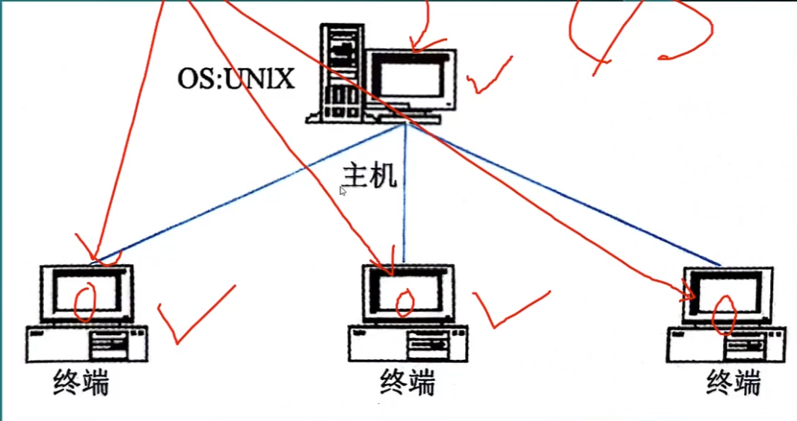

- B/S结构：与两层C/S结构相比，三层C/S结构增加了一个应用服务器。整个应用逻辑驻留在应用服务器上，只有表示层存在于客户机上，故称为“瘦客户机”。
- 应用功能分为表示层、功能层和数据层三层。表示层是应用的用户接口部分，通常使用图形用户界面；功能层是应用的主体，实现具体的业务处理逻辑；数据层是数据库管理系统。以上三层逻辑上独立。
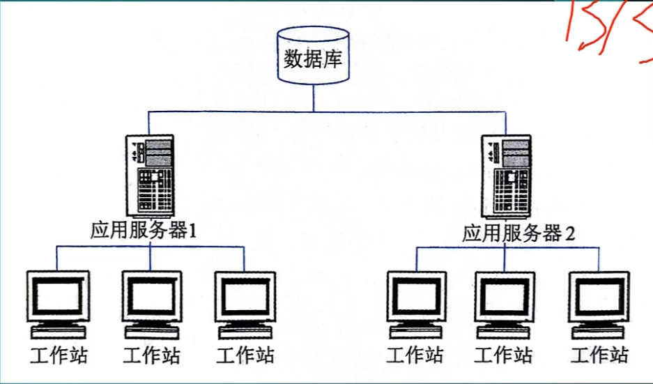

### 数据中心风格

#### 数据中心风格--仓库风格
- 定义：仓库是存储和维护数据的中心场所。在仓库风格中，有两种不同的构件，中央数据结构说明当前数据的状态以及一组对中央数据进行操作的独立构件，仓库与独立构件间相互作用在系统中会有大的变化。这种风格的连接件即为仓库与独立构件之间的交互。
- 优点：业务逻辑层与数据访问层之间的耦合读低，便于存储层技术的扩展。
- 缺点：难以支持高度个性化数据处理需求，设计公共的缓存策略、数据处理方法难度较大。
- 应用领域：MyBatis、Hibernate。

#### 数据中心风格--黑板风格
- 包括知识源、黑板（中央数据单元）和控制单元三部分。知识源包括若干独立计算的不同单元，提供解决问题的知识分子。知识源响应黑板的变化，也只修改黑板；黑板是一个全局数据库，包含问题域解空间的全部状态，是知识源相互作用的唯一媒介；知识源的响应是通过**黑板状态的变化**来控制的。黑板是数据共享体系结构的一个特例，用以解决状态冲突并处理可能存在的不确定性知识源。
- 由黑板、知识源、控制机制组成。
- 优点：便于数据共享，知识源扩展。
- 缺点：数据结构难以达成一致，系统设计复杂度高。
- 应用领域：语音时别、模式时别、松耦合代理数据共享存取。
备注：可以这样理解，真的是一群专家围绕着一块黑板解决问题，一个专家解决了一部分问题后接着给下个专家解决。

### 虚拟机风格*

- 定义：虚拟机风格是人为构建一个运行环境，在这个环境之上，可以解析与运行自定义的一些语言与规则，这样来增加架构的灵活性，适合特定的领域。

#### 虚拟机风格--解释器风格
- 定义：解释器风格是完成解释工作的解释引擎，一个包含将被解释的代码的存储区，一个记录解释引擎当前工作状态的数据结构，以及一个记录源代码被解释执行进度的数据结构。
- 特点：被解释的构件不能直接运行在当前环境。
- 优点：跨平台移植，灵活性，易于调试和开发。
- 缺点：执行效率低，不适合高性能、大并发应用。
- 应用领域：Python解释器、Tomcat、Jetty。
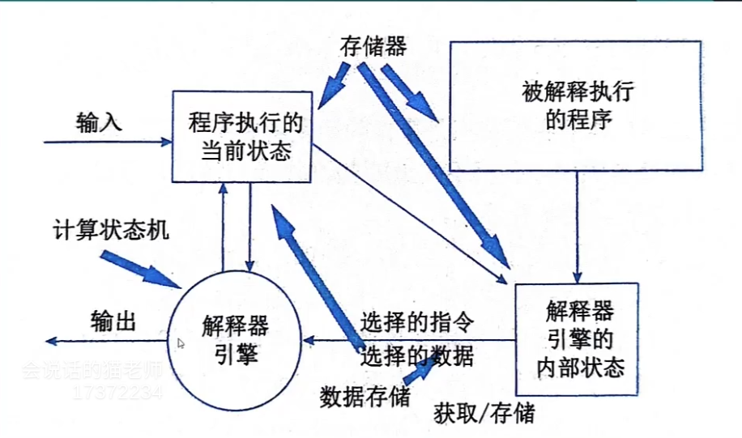

#### 虚拟机风格--规则系统风格
- 定义：规则系统风格包括规则集、规则解释器、规则/数据选择器和工作内存。
- 特点：使用一系列规则和条件来决定程序的行为，这些规则可以是人工定义的，也可以是自动生成的。
- 优点：易扩展，自动化程序高。
- 缺点：只能基于**既有规则**运行，规则复杂的话设计难度大，管理难度也大。
- 应用领域：专家系统、决策支持系统。

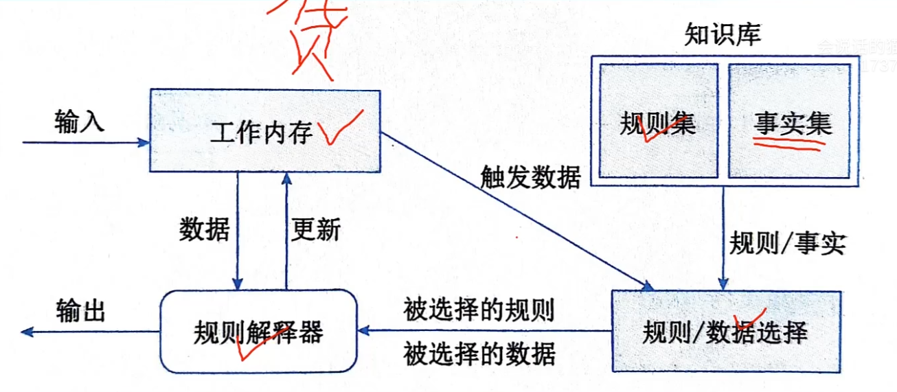

### 独立构件风格
- 定义：主要强调系统中的每个构件都是相对独立的个体。它们之间(一般)不直接通信，以降低耦合度，提升灵活性。

#### 独立构件风格--进程通信风格
- 定义：构件是独立的过程，连接件是消息传递。这种风格的特点是构件通常是命名过程，消息传递的方式可以是点到点、异步或同步方式及远程过程调用等。
- 特点：多进程系统中，进程之间不直接交换信息。
- 适用场合：消息队列

#### 独立构件风格--事件系统风格
- 定义：即基于事件的隐式调用风格，思想是构件不直接调用一个过程，而是触发或广播一个或多个事件。系统中的其他构件中的过程在一个或多个事件中注册，当一个事件被触发，系统自动调用在这个事件中注册的所有过程，这样，一个事件的触发就导致了另一模块中的过程的调用。
- 特点：侧重于系统中的事件生成、事件监听和事件处理，使组件间的耦合度降低。
- 优点：系统的灵活性、可维护性和可扩展性高，简化了复杂问题的处理。
- 缺点：管理协调难度大，数据一致性、性能、稳定性等问题解决难度大。
- 适用场合：微服务、SOA。
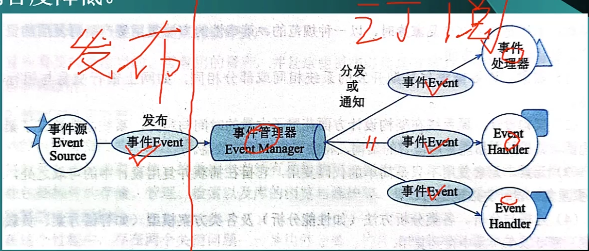
## 基于架构的软件开发方法/过程
### 综述
- 定义：**基于体系结构的软件设计(ABSD： Architecture-Based Software Design)** 是由体系结构驱动的，即由构成体系结构的商业、质量和功能需求的组合驱动的。使用ABSD方法，设计活动可以从项目总体框架明确就开始，意味着需求分析还没有完成就开始了软件设计。
- ABSD方法有三个基础：
	1. 功能分解，即使用已有的基于模块的内聚和耦合技术；
	2. 通过选择体系结构风格来实现质量和商业需求；
	3. 软件模板的使用，软件模板定义了一些软件系统的结构。
- ABSD方法是递归的，架构总是清晰的，有助于降低设计的随意性。
- ABSD方法把软件开发过程划分为：体系结构需求、设计、文档化、复审、实现和演化6个子过程。
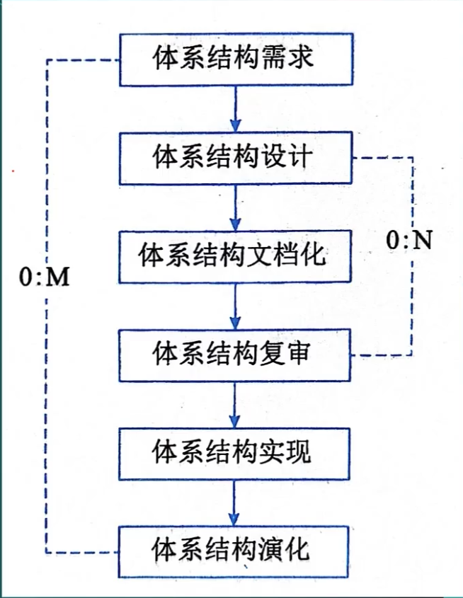

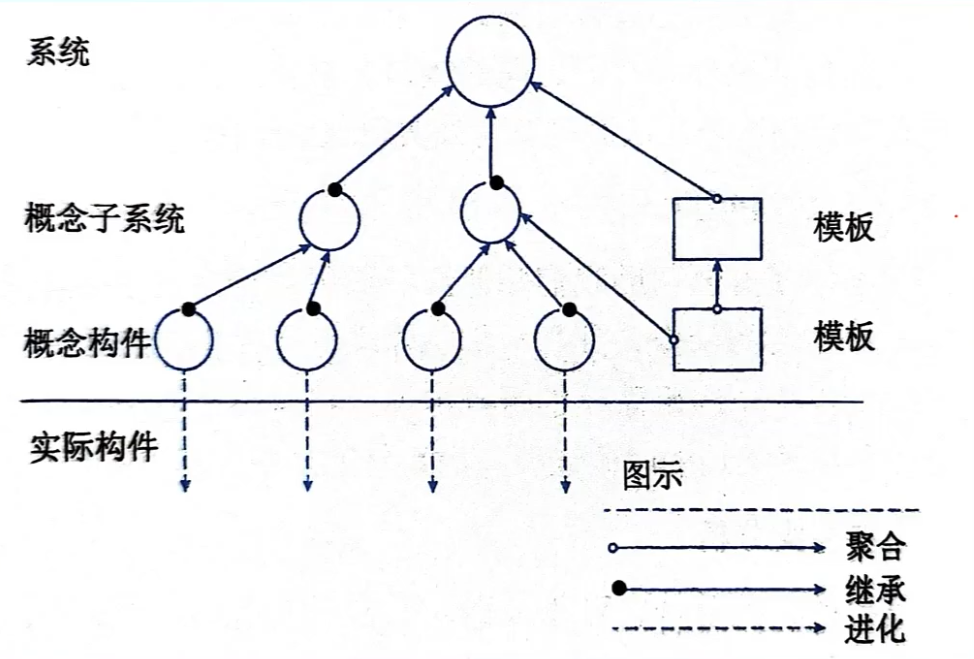
- ABSD方法是一个自顶向下，递归细化的方法，软件系统的体系结构通过该方法得到细化，直到能产生软件构件和类。
- ABSD方法从不同的视角来描述软件的架构，展示功能组织的静态视角能判断质量特征；展示并发行为的动态视角能判断系统行为特征；使用逻辑视图来记录设计元素的功能和概念接口。
- 使用用例来捕获功能需求的同时，将用例定义为特定场景来捕获质量需求，并称这些场景为质量场景。使用质量场景捕获变更、性能、可靠性、交互性，分别叫做变更场景、性能场景、可靠性场景、交互性场景。质量场景必须包括预期和非预期的场景。
### 体系结构需求
- 主要过程包括：需求获取、标识构件、需求评审。
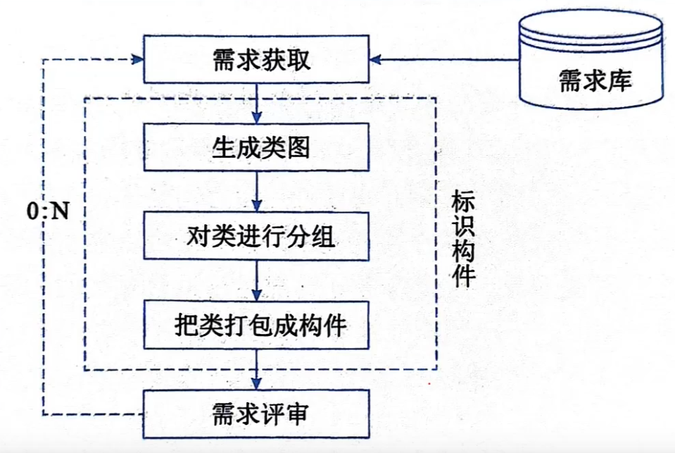

#### 需求获取
架构需求主要来自三个方面：
- 系统的质量目标
- 系统的商业目标
- 系统开发人员的商业目标。
本过程主要是定义开发人员必须实现的软件功能，包括功能性与非功能性需求。

#### 标识构件
生成类图，对类进行分组，把类打包成构件。

#### 需求评审*
获取的需求是否真的反映了用户的需求；
类的分组是否合理；
构件合并是否合理等。

### 体系结构设计
使用“4+1”视图分析质量目标，架构设计是一个迭代的过程，如果能从已有系统导出，则可以复用。
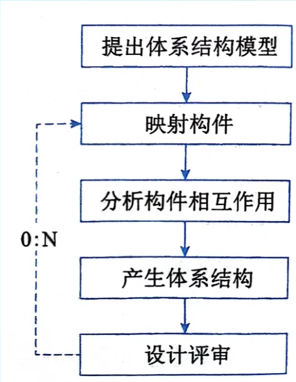

- 提出架构模型：设计架构，首先应选择一个合适的架构风格，通过这个风格可以获得对架构属性的了解，为后续工作建立目标。
- 把已标识构件映射到架构中：映射需求阶段确定的构件，将产生一个中间结构，只包括明确适合架构的构件。
- 分析构件之间相互作用和关系：使用“4+1”视图模型。
- 产生软件架构：基于构件间的相互作用和关系，可不断精化第二阶段的中间结构。
- 设计评审*：一般由独立于开发人员的外部人员承担。

### 体系结构文档化
主要输出物为两个文档：
1. 体系结构规格说明；
2. 测试体系结构需求的质量设计说明。
生成需求模型构件的精确的形式化的描述，作为用户与开发者之间的契约。文档应发给所有参与者并确保最新。

### 体系结构复审
> 注：后续进阶部分还会详细说明。

一个主版本的架构设计完成后，应进行由外部人员（用户代表、领域专家）参与的复审。“设计-文档化-复审”为一个迭代的过程，目的是标识潜在风险，及早发现设计中的缺陷和错误，包括架构能否满足需求、质量需求能否体现、层次是否清晰、架构划分是否合理等。

常以设计出来的架构搭建一个最小化系统来评估架构的合理性。

### 体系结构实现

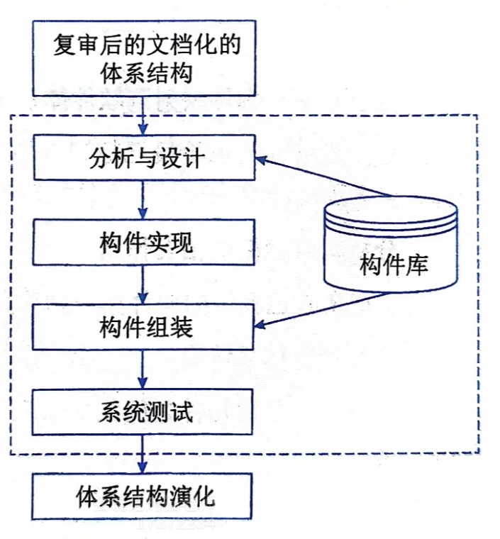

- 用实体来显示一个软件的体系结构，即要符合架构说明书所规定的结构性设计决策，分割成规定的构件，按规定方式交互。
- 可采用构件库复用，最后一个阶段为测试，包括单元测试、集成测试、系统测试、性能测试等。

### 体系结构演化
对体系结构进行修改，以适应变化了的新需求。
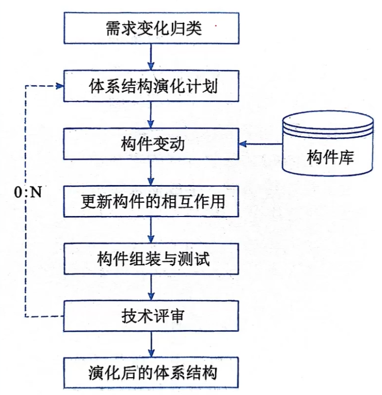

- 需求变化归类：使变化的需求与系统已有构件对应，标记出无法对应的构件。
- 制定架构演化计划：制定周密计划作为后续工作的指导。
- 修改、增加或删除构件：根据需求变动情况对系统已有构件进行调整。
- 更新构件的相互作用
- 构件组装与测试
- 技术评审

### 出题/解题思路
- 上午：几道选择题
- 论文：先介绍项目背景，然后把上述ABSD方法写一遍，再写上项目是怎么根据ABSD来进行处理的。

## 软件架构复用

### 出题情况
- 上午选择题
- 下午论文题：论软件架构复用

### 架构复用的定义及分类

- 软件复用指的是系统化的软件开发过程：开发一组基本的软件构造模块，以覆盖不同的需求/体系结构之间的相似性，从而提高系统开发的效率、质量和性能。软件复用是一种系统化的软件开发过程，通过时别、开发、分类、获取和修改软件实体，以便在不同的软件开发过程中重复的使用它们。
- 软件架构复用的类型包括：机会复用和系统复用。
- 机会复用：开发过程中，主要发现有可复用的资产就对其复用；
- 系统复用：开发之前就要进行规划，以决定哪些需要复用。

### 架构复用的原因

架构复用可以减少开发工作、减少开发时间、降低开发成本、提高生产力，使产品具有更好的互操作性，简化维护工作。

### 架构复用的对象及形式

### 架构复用的基本过程

## 特定领域软件架构

## 历年试题解析-上午

## 历年试题解析-案例

