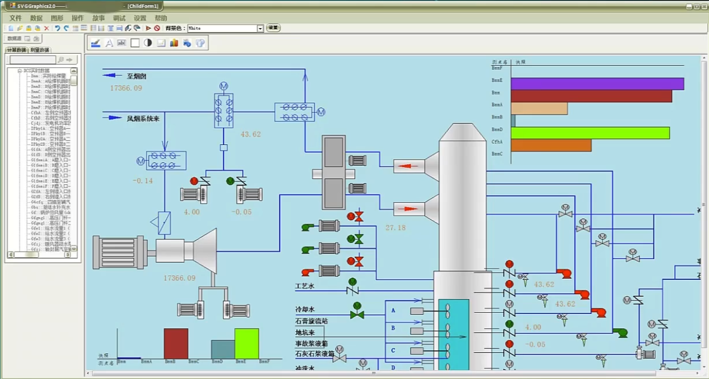
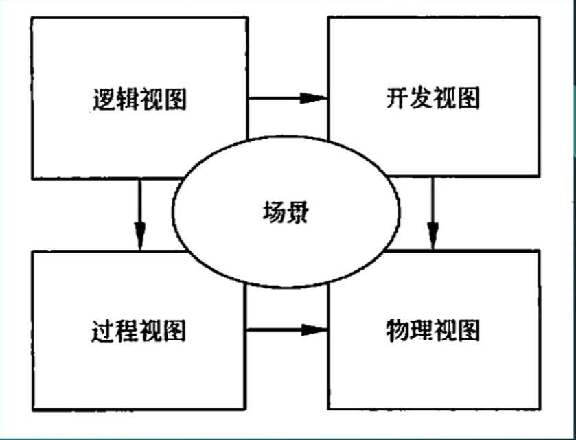

+++
title = "软件架构基础"
date = '2026-08-23T15:57:40+08:00'
draft = false
tags = ["软考", "架构师", "高级架构师", "架构基础"]
categories = ["软考架构高级"]
+++

## 考情分析
上午题：10分左右，考察概念的应用
案例：基础部分与进阶部分综合题
论文：以章节题目组织

**一切皆重点，全背**

## 软件架构综述
### 1、项目介绍
大数据可视化组态软件

### 架构的概念
- 一个程序和计算机系统软件体系结构（架构）是指系统的一个或多个结构。结构中包括软件的构件，构件的外部可见属性以及它们之间的相互关系。
- 体系结构并非可运行软件，它是一种表达，使软件工程师能够：
	1. 分析设计在满足所规定需求方面的有效性。
	2. 在设计变更相对容易的阶段，考虑体系结构可能的选择方案。
	3. 降低与软件构造相关的风险。

- 架构的重要性：
	1. 架构设计能够满足系统的品质
	2. 架构设计能使受益人达成一致的目标
	3. 架构设计能够支持计划编排的过程
	4. 架构设计对系统开发的指导性
	5. 架构设计能够有效管理复杂性
	6. 架构设计为复用奠定基础
	7. 架构设计能够降低维护费用
	8. 架构设计能够支持冲突分析

### “4+1”视图
从多视角对软件结构进行描述，体现“关注点分离”的思想。

- 逻辑视图：又叫设计视图，是设计的对象模型。
- 进程视图：又叫过程视图，捕捉设计的并发和同步特征。
- 物理视图：又叫部署视图，描述了软件到硬件的映射，反映了分布式特征。
- 开发视图：又叫实现视图，描述了在开发环境中软件的静态组织结构
- 场景：及需求用例，作为一个驱动因素来设计4个视图。

## 架构风格
13～16分，选择、案例都可能会出
### 架构风格综述

软件架构风格是描述某一特定应用领域中系统组织方式的惯用模式。架构风格定义一个系统家族，即一个体系结构定义一个词汇表和一组约束。词汇表中包含一些构件和连接件类型，而这组约束指出系统是如何将这些构件和连接件组合起来的。架构风格反映了领域中众多系统所共有的结构和语义特征，并指导如何将各个模块和子系统有效组成一个完整的系统。
（注：一个项目中可能有多个架构风格）
### 数据流风格

数据流风格把系统看作一系列数据转换过程，数据依次经过各个处理构件，每个构件读取输入数据、进行处理并产生输出数据；典型形式包括批处理序列和管道-过滤器。

- 特点：强调系统内部不同部分之间的数据流动，侧重于描述系统中的数据处理过程，以及数据是如何从一个组件传递到另一个组件中的。
- 使用场景：大量数据需要处理和传递，不适合交互场景。
- 主要组成元素：
	1. 处理器：负责执行特定任务的组件，包括数据的处理和转换。这可以是算法、函数、模块等。
	2. 连接件：在处理器之间传递数据的路径。它表示数据从一个地方到另一个地方的传递通道。
- 主要分为：
	1. 批处理序列（Batch Sequential）
	2. 管道-过滤器（Pipe and Filter）
- 编译器、Unix/Linux 管道、音视频处理流水线都是非常典型的例子

#### 数据流风格--批处理风格
- 定义：批处理风格的每个步骤是一个单独的程序，**每一步必须在前一步结束后才能开始**，并且数据必须是**完整的**，以整体的方式传输。它的基本构件是独立的应用程序，连接件是某种类型的媒介。
- 特点：一批数据整体线性处理，每个阶段处理完会生成临时文件，下一阶段从临时文件读取数据，如windows的BAT文件。
- 优点：大量数据处理具有高效率，自动化。
- 缺点：难以满足交互性需求，出错难以调试。

#### 数据流风格--管道-过滤器风格
- 定义：把系统拆解为几个惯序的处理步骤，步骤之间通过数据流里连接，一个步骤的输出是另一个步骤的输入。每个处理步骤由一个过滤器实现，步骤之间的数据传输由管道负责。每个过滤器都有一组输入和输出，过滤器从管道读取数据，处理后再写入管道。
- 特点：过滤器之间直接传递数据，数据流可串行也可并行。
- 优点：支持并发。
- 缺点：与批处理相同。

#### 过程控制/闭环风格
注：这里有歧义，通常属于“过程控制风格”。
- 特点：实时监控，反馈，反向控制。
- 例子：电机控制，转速不够则加大力度；空调温度过高则降低温度等。

### 调用/返回风格
#### 定义
是指在系统中采用了调用与返回机制。利用调用/返回实际上是一种分而治之的策略，其主要思想是将一个复杂的大系统分解为一些子系统，以便降低复杂度，并且增加可修改性。程序从其执行起点开始执行该构件的代码，程序执行结束，将控制返回给程序调用构件。

#### 特点
通过函数或方法的调用来执行任务，并在完成后返回结果到调用方。

#### 调用/返回风格--主程序/子程序风格
- 定义：一般采用单线程控制，把问题划分为若干处理步骤，构件即为主程序和子程序。子程序通常可合成为模块。过程调用作为交互机制，即充当连接件。调用关系具有层次性，其语义逻辑表现为主程序的正确性取决于它调用的子程序的正确性。
- 特点：采用单线程控制，把问题化分为若干处理步骤，构件即为主程序和子程序。
- 优点：结构清晰、代码重用性好、控制能力强。
- 缺点：耦合度大、不易扩展、系统变复杂后难以理解。

#### 调用/返回风格--面向对象风格
- 定义：建立在数据抽象和面向对象基础上，数据的表示方法和它们的相应操作封装在一个抽象数据类型或对象中。这种风格的构件是对象，或者说是抽象数据类型的示例。
- 优点：代码可读性高、易扩展。
- 缺点：执行效率低。

#### 调用/返回风格--层次型风格
- 定义：组成一个层次结构，每一层为上层提供服务，并作为下层的客户。在一些层次系统中，除了一些精心挑选的输出函数外，内部的层接口只对相邻的层可见。这样的系统中构件在层上实现了虚拟机。连接件由通过决定层间如何交互的协议来定义，拓扑约束包括对相邻层间交互的约束。由于每一层最多只影响两层，同时只要给相邻层提供相同的接口，允许每层用不同的方法实现，这同样为软件重用提供了强大的支持。
- 优点：把复杂问题简单化、系统扩展性好。
- 缺点：划分层次困难、效率低。

### 数据中心风格

### 虚拟机风格

### 独立构件风格

## 基于架构的软件开发

## 软件架构复用

## 特定领域软件架构

## 历年试题解析-上午

## 历年试题解析-案例

