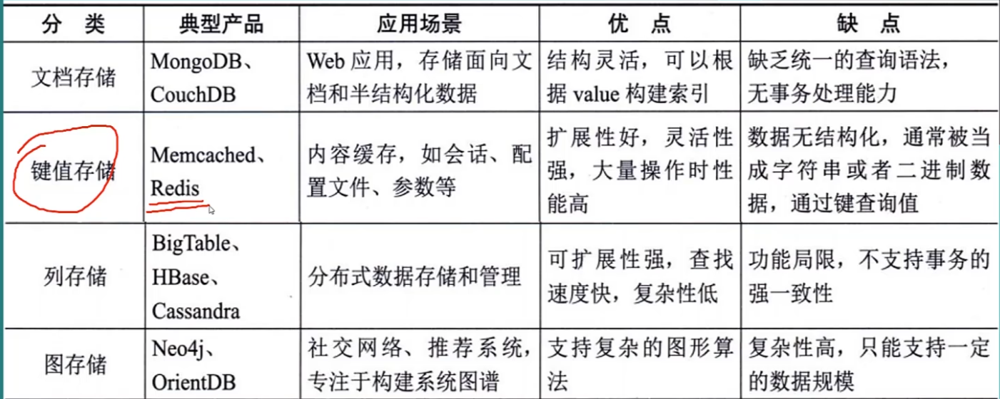
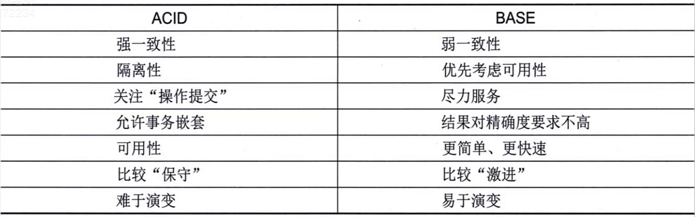

+++
title = "数据库设计"
date = '2026-07-25T10:45:40+08:00'
draft = false
tags = ["软考", "架构师", "高级架构师", "数据库"]
categories = ["软考架构高级"]
+++

## 一、考情分析
- 选择：3-4分左右，考察概念的应用
- 考点：所有重点知识均有
- 案例：一道数据库设计综合性大题（第2大题）；以非关系型数据库为背景的综合题

## 二、数据库综述
### 1. 数据库基本概念
数据、数据库、数据库系统。<br>
数据模型：描述数据的一组概念或定义，包括：数据结构、数据操作、约束条件。<br>

- 数据结构：对象类型的集合，是对系统静态结构的描述。
- 数据操作：对数据库中各种对象的实例允许执行的操作的集合。
- 约束条件：一组完整性规则的集合
### 2. 数据库的三级模式结构

三级层次结构、三级模型、两级独立性
#### 三级层次结构
- 视图层：最高层次抽象，描述整个数据库某个部分的数据，简化用户与数据库的交互，保证数据的保密性和安全性。
- 逻辑层：比物理层更高的抽象，描述数据库中存储的数据以及这些数据间的关系。
- 物理层：最低层次抽象，描述数据在存储器中如何存储，描述详细的复杂结构。
#### 三及模型--外模型、概念模式、内模式
- 概念模式：也称模式，是数据库中全部数据的逻辑结构和特征的描述，只涉及型的描述，不涉及具体值，反映数据库的结构及其联系。
- 外模式：也称用户模式或子模式，是用户与数据库系统的接口，是用户需要使用的那部分数据的描述。
- 内模式：也成存储模式，是数据物理结构和存储方式的描述，是数据在数据库内部的表示方式。
#### 两级独立性
- 物理独立性：用户的应用程序与存储在磁盘上的数据库中的数据是相互独立的，当数据的物理存储改变时，应用程序不需要改变。
- 逻辑独立性：用户的应用程序与数据库的逻辑结构时相互独立的，当数据的逻辑结构改变时，应用程序不需要改变。

## 三、关系代数*
### 1. 概述

运算符的优先级：投影 > 选择 > 笛卡尔积 > 连接 > 并 > 差 > 交
### 2. 集合运算
#### 1. 并
关系R与关系S具有相同的关系模式（结构相同），R与S的并是由数据R或属于S的元素构成的集合。


#### 2. 交
关系R与关系S具有相同的关系模式（结构相同），R与S的交是属于R、同时又属于S的元素构成的集合。


#### 3. 差
关系R与关系S具有相同的关系模式（结构相同），R与S的差是由属于R但不属于S的元素构成的集合。


#### 4. 笛卡尔积
两个元数分别为n目和m目的关系R和S的笛卡尔积是一个（n+m）列的元组集合，前n列是R的元组，后m列是S的元组。
相当于“穷举”。


### 3. 关系运算
#### 1. 选择
选择运算是从关系的水平方向进行运算，是从关系R中选择满足给定条件的诸元组。
选择就是取出行，**先做选择效率高**


#### 2. 投影
投影运算是从关系的垂直方向进行运算，是从关系R中选出若干属性列组成新的元组。


#### 3. 连接
连接运算是从两个关系R和S的笛卡尔积中选择满足条件的元组。
**自然连接**是一种特殊的等值连接，它要求两个关系中进行比较的分量必须是相同的属性组，且在结果集中去掉重复列。


### 4. 关系运算的例题
- 例题1

- 例题2


## 规范化理论*
### 基本概念
#### 1. 属性、域、目/度

属性：事物的若干特征。
```
如上述S表中的(Sno/Sname/Sex/SD/Age)
C表中的 Cno、Cname、Pcno、Credit
SC表中的 Sno、Cno、Grade
```
域：属性的取值范围对应的值的集合。
```
如属性Sex，取值范围是[男，女]
```
目/度：一个关系中属性的个数
```
如S表中有5个，C表有4个，SC表有3个
```

#### 2. 码、主/非主属性、外码
- 码：设K为R(U,F)中属性的组合，若 K -> U，且对于K的任何一个真子集K'，都有K' 不能决定U，则K为R的候选码。若有多个候选码，则选一个作为主码。

- 主/非主属性：包含在任何一个候选码中的属性成为主属性，否则称为非主属性。

- 外码：若R(U)中的属性或属性组X非R的码，但是X是另一个关系的码，则成X为外码。
```
注意上述SC表，由(Sno, Cno) -> Grade，(Sno, Cno)联合起来是码，而且Sno、Cno分别又是外码
```

#### 3. 关系
关系：关系模式可形象化表示为：R(U, D, dom, F)，其中，R为关系名；U为属性名；D为域；dom为属性向域的映射；F为属性依赖关系的集合。
一般关系可简化表示为：R(U) 或R(A1, A2, A3, ..., An)

#### 4. Armstrong公理
设关系模式R(U, F)，其中U为属性集，F为U上的一组函数依赖，那么有如下推理规则：
- A1自反率
```
如果 Y ⊆ X，那么 X → Y
// 如果 Y 本来就是 X 的一部分，那么知道 X，自然就知道 Y。
// {学号, 姓名, 专业} → {姓名, 专业}
```
- A2增广率
```
如果 X → Y，那么 XZ → YZ
// 如果 X 能确定 Y，那么在 X 和 Y 两边同时增加相同的信息 Z，依赖关系仍然成立。
```
- A3传递律
```
如果 X → Y，并且 Y → Z，那么 X → Z
// 如果 X 能确定 Y，Y 又能确定 Z，那么 X 就能间接确定 Z。
```
根据上面三条推理规则，又可推出下述三条推理规则：
- 合并规律
```
已知X → Y，X → Z，则X → YZ
// X 分别能够确定 Y 和 Z，自然也能同时确定 Y 和 Z。
```
- 伪传递率
```
已知 X → Y，WY → Z，则WX → Z

```
- 分解率
```
已知X → YZ，可以推出X → Y，X → Z
// 能确定一个整体，也就能分别确定整体中的各个部分。
```

### 函数依赖
#### 定义
设R(U)是属性集U上的一个关系模式，X，Y是U的子集，若对R(U)的任意一个可能的关系，r，r中不可能有两个元组满足在X中的属性值相等而在Y中的属性值不等，则称“X函数决定Y”或“Y函数依赖与X”，记作X → Y。

- 完全函数依赖
假设：{学号,课程号} → 成绩
而且：学号 x ↛  成绩、课程号 → 成绩
说明必须同时知道学号和课程号，才能确定成绩。少任何一个都不行，这称为**完全函数依赖**。

- 部分函数依赖
```
假设有：{学号,课程号}→学生姓名
但是实际上：学号→学生姓名
仅凭学号就能确定学生姓名，课程号是多余的。
因此“学生姓名”只依赖于组合属性的一部分，这叫**部分函数依赖**。
```

- 传递函数依赖
```
假设：学号→专业，专业→学院
于是：学号→学院
学号不是直接确定学院，而是通过专业间接确定学院，这称为传递函数依赖。
```

#### 码的判定

例1：
```
因为：AB → C，C → E，所以AB → CE
因为：B → D，所以 AB → AD，又因为AB → CE，所以 AB → ACDE
此时关系U中的元素都存在了，所以关系模式确定完毕，码是AB
```
例2：
答案是CE

### 关系的分解
#### 无损连接分解
指将一个关系模式分解成若干个关系模式后，通过自然连接和投影运算仍然能还原到原来的关系模式。


分解后，函数依赖不保持了，则大概率是有损连接了；
如果不确定的话，需要用表格法 TODO 来计算是否是无损连接。

### 范式
#### 定义
- 第一范式（1NF）：若关系模式R的**每一个分量是不可再分**的数据项，则关系模式属于1NF。

- 第二范式（2NF）：若关系模式R满足1NF，且每一个非主属性完全依赖于码，则关系模式属于2NF。（2NF消除了部分依赖）

- 第三范式（3NF）：若关系模式R（U，F）中不存在这样的码X，属性组Y及非主属性Z，使得X → Y，Y → Z成立，则关系模式属于3NF。（3NF消除了传递依赖）

#### 完整性约束
- 实体完整性：基本关系R的主属性不能取空值。
- 参照完整性：若F是关系R的外码，它与关系S的主码K对应，则F在R上的取值要么为空，要么为S中某个元素的主码值。
- 用户定义完整性：针对某一关系型数据库的约束条件，反映某一具体应用所涉及的数据必须满足的语义要求。

## 数据库设计*--重要(背)

能背则背，很重要！！

### 需求分析
#### 概念
背：
需求分析是在项目确定之后，用户和设计人员对数据库应用系统所要涉及的内容（数据）和功能（行为）的整理和描述，是以用户的角度来认识系统。

了解：
需求分析阶段的任务：综合各个用户的应用需求，对现实世界要处理的对象（组织、部门、企业等）进行详细调查，在了解现行系统概况，确定新系统的过程中，收集支持系统的目标基础数据及处理方法。

需求分析的方法：自顶向下（数据流图、数据字典）、自底向上。

在需求分析阶段，需要满足以下要求：
- 信息要求：用户要在系统中保存哪些信息，由这些信息要得到设呢信息，这些信息及信息间的完整性要求。
- 处理要求：用户在系统中要实现什么样的操作功能，对信息的处理过程、方式、频度、安全性、完整性要求等。
- 系统要求：包括安全性要求、使用方式要求、可扩充性要求等。

### 概念结构设计*
概念结构设计的目标是产生反映系统信息需求的数据库概念结构，即概念模式。
设计人员从用户的角度看待数据及数据处理的要求和约束，产生一个反映用户观点的概念模式。

#### 实体-联系模型（E-R模型）
E-R模型接近人类正常思维方式，采用实体、联系、属性来说明事物间的语义关系。
- 实体：现实世界中可以区别于其他对象的事件或物体，用矩形框表示，框内写明实体名。
- 联系：实体之间的关系，用菱形表示，菱形内写明联系名。通常有3种联系类型，一对一、一对多、多对多。
- 属性：实体某方面的特征，用椭圆表示，椭圆内写明特征名。


#### E-R模型元素的绘制方法
包括分类、聚集和概括。
- 分类：对现实世界的事物，按照其具有的共同特征和行为，定义一种类型。
- 聚集：定义某一类型的所有属性。
- 概括：由已知类型定义新的类型。已知类型称为超类，新定义的类型称为子类，子类是超类的子集。

#### 概念结构设计工作
包括：选择局部应用、逐一设计分E-R图和E-R图合并。
- 选择局部应用：逐层梳理DFD图，找到某个合适的层次，作为局部应用，实现某一项功能。
- 逐一设计分E-R图：依照局部应用的DFD图，从数据字典中提取数据，使用抽象机制，确定局部应用中的实体、联系和属性，设计分E-R图。
- E-R图合并：对分E-R图进行合并，合并的目的是解决分E-R图中相互存在的冲突，消除信息冗余，形成一张全局E-R图。

#### E-R图冲突的表现
1. 属性冲突：同一属性，不同设计人员在不同分E-R图上对属性值类型，取值范围、单位等可能设计不一致。
2. 命名冲突：相同意义的属性在不同分E-R图上有不同命名；或名称相同的属性在不同分E-R图上有不同意义。
3. 结构冲突：同一实体在不同分E-R图上属性不同；同一对象在有的分E-R图上表示为实体，另一分E-R图上表示为属性。

#### E-R图的优化
1. 合并实体类型：具有1：1 或 1：n联系的实体可合并
```
如：
丈夫--妻子是一对一，可以去除一个，然后添加属性：配偶
学生--导员是一对多，可以去除导员实体，在学生实体上添加属性：导员
```
2. 消除冗余属性
```
只保留跟实体有关的属性，其他无关属性去除
```
3. 消除冗余联系
```
消除环状联系
```

### 逻辑结构设计*
逻辑结构设计即在概念结构设计的基础上进行数据模型设计，主要工作包括：确定数据模型、将E-R图转换为指定的数据模型、确定完整性约束和确定用户视图。

#### 将E-R图转换为关系模型
将E-R图转换为关系模式，实体名对应关系名称，实体属性转换为关系的属性，实体标识符转变为关系的码。
- 1：1联系：可将联系转换为独立关系模式，属性包括该联系关系的两个实体的码及联系的属性；可将联系归并到任一个关联实体中，给待归并一方增加另一个实体的码和联系的属性。
- 1：n联系：
	1. 可将联系转换为独立关系模式，属性包括该联系关联的两个实体的码及联系的属性，码是多方实体的码；
	2. 可将联系归并到两个关联实体的多方，给待归并的多方增加另一个实体的码和联系的属性
- m：n联系：多对多联系只能转换为另一个独立的关系模式，属性取该联系关联的两个多方实体的码和联系的属性，码是多方实体构成的属性组。

#### 关系模型规范化
1. 根据语意确定函数依赖。
2. 根据语义依赖确定是否至少达到了3NF。
3. 如果关系模式不满足要求，则要按照函数依赖对其进行分解。
4. 关系模式的评价及修正，必要时添加冗余属性。

#### 确定用户视图
> 备注：如果直接将数据库表结构暴露出去的话会有安全风险，所以"封装"了一层视图，用户查询时只能看到这一层视图。
1. 根据数据流图确定处理过程使用的视图。
2. 根据用户类别确定不同用户使用的视图。

#### 反规范化
反规范化：多表关联会造成查询性能下降，对影响性能的关系模式进行反规范化设计以加速读操作性能。

> 反规范化应用条件：
> 1. 非关系型数据库，如NoSQL
> 2. 数据量特大
> 3. 数据一旦确定后几乎不修改
> 4. 对数据的操作以查询为主

常见的反规范化方法：冗余列、派生列、表重组、表分割（水平分割、垂直分割）。
- 冗余列：提前把别的表中的数据复制过来，减少查询时的表连接，通过提前把列读出来了，减少了多表连接的动作，进而加速整体查询速度。
- 派生列：某个字段的值可以根据其他原始数据计算出来，但为了提高查询速度，提前把计算结果保存下来，将查询时的计算提前到数据写入或更新时完成。比如商品表中，可能不会保存实际价格，实际价格根据查询时进行计算，为了加速添加一列总价，这样就不需要每次查询再计算了。
> 冗余列是“以空间换连接时间”，派生列是“以空间和写入成本换计算时间”。

### 物理设计
主要工作包括：确定数据分布、确定存储结构和确定访问方式。
其中访问方式这里还会做索引。
> 哪些属性做索引？索引不是越多越好
> 1. 主键
> 2. 可能会进行max、min、avg、sort等计算的属性

## 非关系数据库*--重要(背)
要理解，主要出案例题
### 1. 概述(理解，不用背)
`NoSQL`数据库是一种非关系型数据库，通常不依赖与传统的表结构和`SQL`语言来管理数据。它们支持灵活的数据模型，可以存储结构化、半结构化和非结构化的数据。
**主要特点**：
- 高扩展性：支持横向扩展（分布式架构），可以轻松地增加更多的机器来提高存储容量与处理能力。
- 高可用性与容错性：不需要像关系型数据库那样严格的表结构，可以使用更为灵活的数据模型，适应不同类型的数据存储需求。
- 高性能：在处理大规模数据和高并发请求时，通常表现出较高的性能，尤其在读取和写入操作上，能够达到比传统关系型数据库更高的吞吐量。
- 简化查询语言：`NoSQL`数据库往往不使用`SQL`标准查询语言，而是使用更为简化或自定义的查询方式。
**通常分为四种主要类型**：文档性、键值型、列族型和图数据库。


**NoSQL数据库通常适用于以下几种场景：**
- 高并发：可以水平扩展来分散负载
- 大规模数据存储：提供了良好的扩展性，分布式
- 灵活的数据结构：图片、音频等
- 低延迟需求：像Redis这样的键值型数据库非常适合需要低延迟、高吞吐量的缓存应用；能直接写在内存里，读写速度很快。

**NoSQL与传统关系型数据库的差异**：
- 灵活性：
	1. 关系型数据库表结构固定性较强，修改表结构时代价高；
	2. NoSQL支持动态变化的数据模型，适合非结构化或半结构化数据。
- 扩展性：
	1. 传统关系型数据库大多是垂直扩展（加大单机硬件配置），扩展性有限；
	2. NoSQL可水平扩展，适合大规模分布式系统。
- 查询性能：
	1. 关系型数据库使用SQL语言查询，适用于复杂的联结查询和事物管理，但海量数据和高并发场景下性能可能成为瓶颈；
	2. NoSQL通过键值对或其他简化的查询方式提供极高的读写性能，特别适合海量数据、高并发场景，但在复杂查询方面可能不如关系型数据库灵活。

**数据一致性**：
- 关系型数据库：提供严格的ACID事物保证，数据一致性较强，适用于需要高一致性的场景。
- NoSQL：大多数采用最终一致性模型，允许分布式环境中实现更好的性能和可用性，适用与对一致性要求相对较低的场景。

### 2. 相关理论
#### CAP理论
CAP理论仅针对分布式系统，即多网络系统
一致性(Consistency)、可用性(Avalilability)和分区可容忍性(Partition tolerance)
在分布式系统发生网络分区 P 时，要么优先保证数据一致性 C，要么优先保证服务可用性 A，无法同时无条件保证二者。
- 一致性：对同一份数据，从不同节点访问时，应该看到一致的、符合最新写入结果的数据。
- 可用性：对系统发出的请求，只要节点本身没有故障，就应该在有限时间内得到响应（任何时候都能对数据进行读写）。
- 分区可容忍性：分布式系统中的节点因为网络故障而无法互相通信。
	AP：国内大型电商平台一般都用这个，选择AP要考虑BASE
	CP：满足CP的一般是关系型数据库，选择CP要考虑ACID（传统关系型数据库的基石，事物的4个特点）
	CA：跨网络下一般认为不存在

#### BASE理论
**BASE：** BasicAvalability, Soft-State, Eventual Consistency，是一个弱一致性理论，只要求最终一致性。


#### 分区
分布式系统中，数据该往哪一个节点存，是否需要备份等等情况，需要在设计中考虑“分区”的概念。
分区的主要方法：
1. 内存缓存：缓存技术可以看成一种分区，常见的使用如视频网站缓存。
2. 集群：横向扩展。
3. 读写分离：主要指关系型数据库，一个节点只做读，另一个只做写。
4. 范围分割技术：按照某种方式，将不同数据分割放入不同节点，比如按照数据日期，"7点到10点"写入节点1、"11点到12点的数据"写入节点2等等。
5. 分片(Shading)：将大文件拆分成多个小文件再存到不同节点，如将视频拆分成多个小文件存储，会提高读写效率，但是文件可靠性会降低。

#### 存储布局
NoSQL在硬盘上的存储方式。主要有4种：基于行的存储布局、列存储布局、带有局部性群组的列存储布局、LSM-Tree。
- 行存储：类似与关系型数据库的行，一行一行的存储。
- 列存储：两个关系有相同的一列属性，把这种列提取出来单独存储。
- 带有局部性群组的列存储：指根据需要将原来不存储在一起的数据，以列为单位存储至单独的子表中。如用户对网站排名、语言等分析信息感兴趣，那么可以将这些列放在单独的子表中，减少无用信息读取，改善存储效率。
- LSM-Tree：日志结构合并树，主要解决日志记录索引的问题，在内存里维护一个B树。

#### 查询模型
NoSQL有较强的性能和可扩展性，但是查询性能较差。

### 3. 常见NoSQL数据库
#### 键值数据库
K-V，具有极高的并发读写性能。
键很灵活，可以是图片名称、网页URL或者文件路径名等。
键值存储中存在三种操作：put、get、delete
	- put：对表添加一个新的键值对，键存在时更新键对应的值
	- get：返回键对应的值
	- delete：将键和值删除
根据数据的保存方式，键值存储数据库可以分为三种：
- 临时性保存：保存在内存
- 永久性保存：保存在硬盘
- 两者兼具型：先写到内存，满足一定条件后批量写入硬盘
常用的键值数据库：`Redis`
```python
# python中使用Redis示例
import redis

# 创建连接对象
client = redis.Redis(host='localhost', port=6379)
# 写入数据
client.set('foo', 'bar')
# 获取数据
result = client.get('foo')
print(result)
# 删除数据
client.delete('foo')
```
`Redis`特点：
1. 键很灵活，除了常见的数据类型外，list、元组等都可以作为键
2. 会进行写硬盘操作，如果数据库挂了，数据还是有可能能恢复的
3. 大并发性能较差

`memcached`特点：
1. 大并发性能强
2. 键只能用字符串
3. 数据库挂了后，数据会全部丢失
`memcached`一般是12306、双11等场景使用，一般企业不使用。

#### 文档数据库
文档数据库以文档为存储信息的基本单位，一般用类似JSON的格式存储

## 其他

## 历年试题解析-选择

## 历年试题解析-案例
