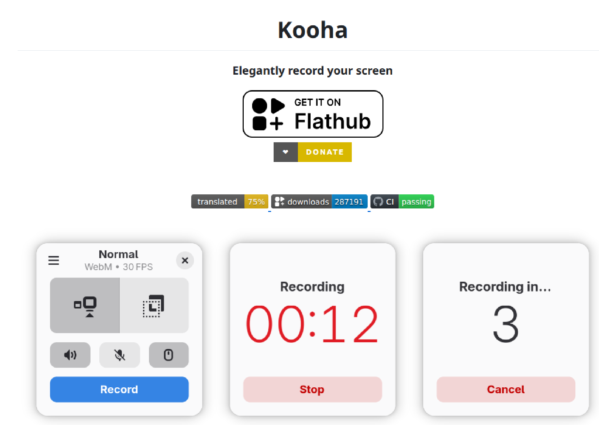
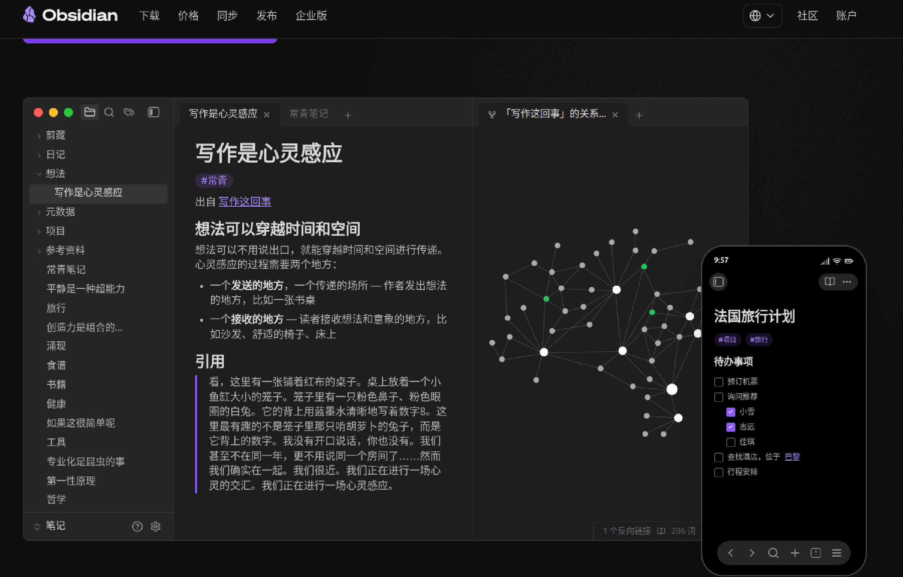

+++
title = "Linux中好用的工具"
date = '2026-07-20T16:48:32+08:00'
draft = false
tags = ["Linux", "tools", "工具", "gif", "markdown", "对比工具", "截图工具"]
categories = ["Linux"]
+++

## gif动图制作工具：Kooha
`Kooha`可进行屏幕录制，开源软件(GPL-3.0 license)，支持录制成`gif`、`mp4`等格式，对于个人记录wiki、写博客等场景功能已满足。官网[github链接](https://github.com/seadve/kooha)
推荐使用`snap`来安装
```bash
sudo snap install kooha
```


## markdown编辑/展示工具：Obsidian
优秀的mardown编辑开源软件，社区插件丰富，基本可满足各种需求，支持`windows`和`linux`，而且还有手机版，非常方便。[官网链接](https://obsidian.md/zh/)
官网的[下载界面](https://obsidian.md/zh/download)中有多种形式的包下载，这里我使用的是`ubuntu`系统，下载的`deb`格式的包进行的本地安装，参考命令：
```bash
sudo apt install ./obsidian_1.12.7_amd64.deb
```


## 对比工具：Meld
一款带图形化界面的二进制对比工具，支持单文件对比、文件夹对比，开源软件([GPLv2 or later](https://www.gnu.org/licenses/gpl-2.0.html))，可以对比文本差异，类似于`beyond compare`。[官网链接](https://meldmerge.org/)
`ubuntu`上可直接安装该工具：
```bash
sudo apt update && sudo apt install meld
```
![]images/(Pastedimage20260720100800.png)

## 截图工具：Snipaste
一款小巧的截图软件，分为免费版和收费版，两个版本的[差异链接](https://docs.snipaste.com/zh-cn/pro)，基本上免费版已经够用，也是支持多个平台，[官网链接](https://zh.snipaste.com/index.html)
对于`linux`版本，官方给的是`AppImage`安装包，需要手动下载解压使用，这里附上我这里的安装配置，配置成按`F1`启动截图：
1. 首先是在官网下载免费版安装包，目前最新版本是`v2.11.3`，下载后的文件为：`Snipaste-2.11.3-x86_64.AppImage`
![[images/Pasted image 20260720102240.png]]
2. 将其解压，解压命令：`./Snipaste-2.11.3-x86_64.AppImage --appimage-extract`，解压后会在当前目录出现一个`squashfs-root/`目录，可以进到这个目录执行`./Apprun`来测试一下安装包是否可用，如功能都正常的话进入下一步
3. 将`F1`按键绑定到上一步的`Apprun`，可以用`pwd ./Apprun`来获取它的绝对路径，然后进行绑定


